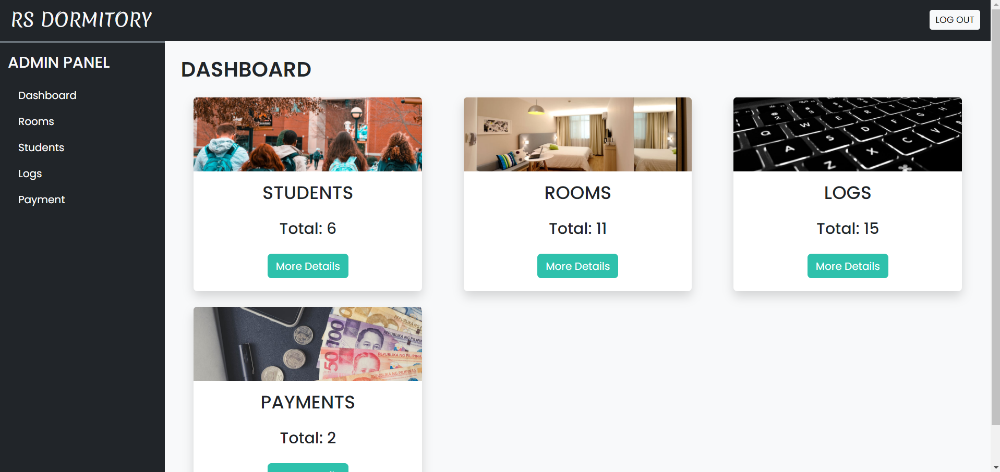

# RS Dormitory Database

## Authors
- Achilles Joaquin S. Zubia 
- Deangelo M. Enriquez 
- Marwin O. Matic 

## Introduction

RS Dormitories is a comprehensive website designed to assist college students in finding dormitory rooms available for rent while attending their respective universities. It provides detailed information about various dormitories across the country, including location, room availability, and pricing.

For administrators, the site offers extensive management capabilities, including the ability to add new dorms, update existing ones, manage user accounts, and access detailed reports and analytics. This ensures that room availability is always up-to-date and allows for continuous improvements to the dormitory offerings.

## Features

### Home Page
- **Navigation:** Links to the About page, Contact page, and other relevant pages.
- **Slider Animation:** Enhances the visual appeal of the page.

- **Login/Registration:** Allows users to log in or register on the website.

- **List of Dormitories:** Displays a list of available rooms.

### List of Rooms Page
- **Room Listings:** Shows all rooms available for booking.

### Admin Page
- **Dashboard:** Displays information about students, rooms, logs, and payments.
- **Management:** Admins can add, edit, and delete content, manage user accounts, and perform other administrative tasks.

## Database Operations

### Insert Function
Used for adding new data to the database, such as registering a student or reserving a room. This operation automatically updates relevant data, such as `student_dorm_data` and `student_stay_data`.

### Delete Function
Used for removing data from the database, including student data, room data, and log data. It also ensures related data, like room occupants and available beds, are updated accordingly.

### Edit Function
Used for modifying existing data in the database, such as student and room information. Students can edit their data via their profile page, while admins can use the admin panel for edits.
